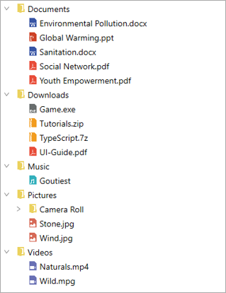

# How to Populate Nodes with Binding to a Data in WPF TreeView?

This repository describes how to populate nodes with binding to a data in [WPF TreeView](https://www.syncfusion.com/wpf-controls/treeview) (SfTreeView).

To create a tree view using data binding, set a hierarchical data collection to the [ItemsSource](https://help.syncfusion.com/cr/wpf/Syncfusion.UI.Xaml.TreeView.SfTreeView.html#Syncfusion_UI_Xaml_TreeView_SfTreeView_ItemsSource) property. And set the child object name to the [ChildPropertyName](https://help.syncfusion.com/cr/wpf/Syncfusion.UI.Xaml.TreeView.SfTreeView.html#Syncfusion_UI_Xaml_TreeView_SfTreeView_ChildPropertyName) property.

``` xml
<Window x:Class="NodeWithImageDemo.MainWindow"
        xmlns="http://schemas.microsoft.com/winfx/2006/xaml/presentation"
        xmlns:x="http://schemas.microsoft.com/winfx/2006/xaml"
        xmlns:d="http://schemas.microsoft.com/expression/blend/2008"
        xmlns:mc="http://schemas.openxmlformats.org/markup-compatibility/2006"
        xmlns:local="clr-namespace:NodeWithImageDemo"
        xmlns:syncfusion="http://schemas.syncfusion.com/wpf"
        xmlns:Engine="clr-namespace:Syncfusion.UI.Xaml.TreeView.Engine;assembly=Syncfusion.SfTreeView.WPF"
        mc:Ignorable="d">

    <Window.DataContext>
        <local:FileManagerViewModel/>
    </Window.DataContext>

    <Grid>
        <syncfusion:SfTreeView x:Name="sfTreeView" 
                               ChildPropertyName="SubFiles"
                               ItemsSource="{Binding ImageNodeInfo}">

            <syncfusion:SfTreeView.ItemTemplate>
                <DataTemplate>
                    <Grid x:Name="grid">
                        <Grid Grid.Row="0">
                            <Grid.ColumnDefinitions>
                                <ColumnDefinition Width="20" />
                                <ColumnDefinition Width="*" />
                            </Grid.ColumnDefinitions>
                            <Grid>
                                <Image Source="{Binding ImageIcon}"
                                               VerticalAlignment="Center"
                                               HorizontalAlignment="Center"
                                               Height="16"
                                               Width="16"/>
                            </Grid>
                            <Grid Grid.Column="1"
                                              Margin="1,0,0,0"
                                              VerticalAlignment="Center">
                                <TextBlock Text="{Binding ItemName}"
                                                   Foreground="Black"
                                                   FontSize="14"
                                                   VerticalAlignment="Center" />
                            </Grid>
                        </Grid>
                    </Grid>
                </DataTemplate>
            </syncfusion:SfTreeView.ItemTemplate>
        </syncfusion:SfTreeView>
    </Grid>
</Window>
```

